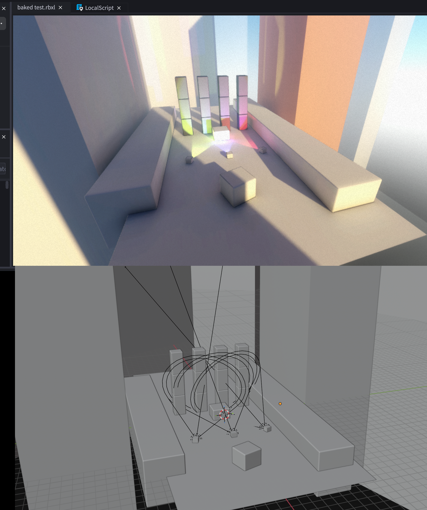

# roblox-bake-export

A simple Blender addon for "baking" pathtraced light for little Roblox demos.


## Install

1. Download [`roblox_blender_bake.py`](./roblox_blender_bake.py).
2. In Blender: `Edit > Preferences > Add-ons > Install...`, pick the file, enable the checkbox.
3. Press `N` in the 3D View, open the **Roblox Bake** tab.


## Use

1. Build a scene. Meshes, lights, optional flat colors or base-color textures on the Principled BSDF.
2. Save the `.blend` (or set an absolute output folder in the panel).
3. Select the meshes to bake, or leave nothing selected to bake all visible meshes.
4. Click **Bake & Export FBX**.

Output:

```
<output_folder>/
  <SceneName>.fbx              # textures embedded, ready for Roblox
  textures/
    <ObjName>_Albedo.png       # one per object
```

Shortcut: `Ctrl+Shift+Alt+B` in the 3D View.

## License

GPL-3.0-or-later. Blender addons inherit Blender's license. See [LICENSE](./LICENSE).
